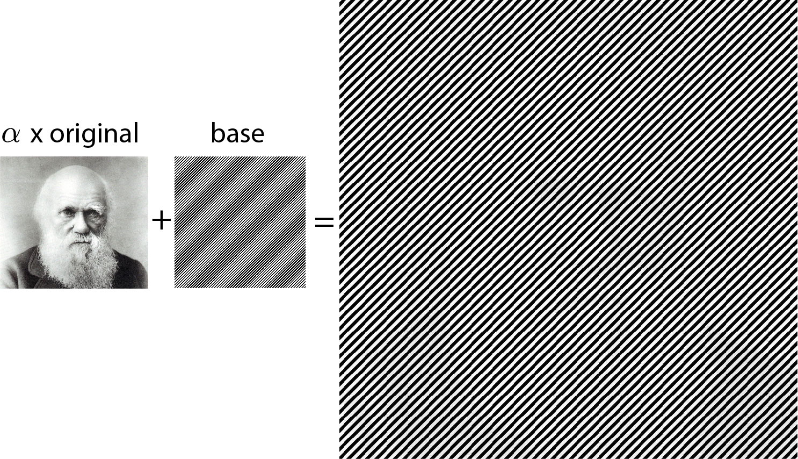

# Hybrid image

Make an hybrid image that can be seen when scrolling, wiggling or motion blur.

__keywords__: stereogram, hybdrid image, python, image processing 

```
Usage:
    python hide.py <image_path> [options]  

options:
  --base            base image to blend with, options= diagonal, checkerboard, concentric
  --alpha           float alpha value of target image, alpha in [0, 1]
  --save_path       save_path of the image
```


